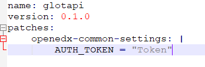
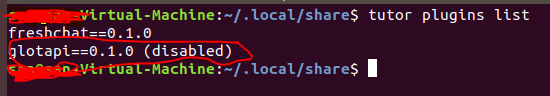
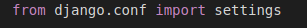
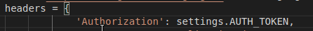

let us create configuration for variable.Take example we are using some external API service we need to call that api with token(auth token)this token can be changed so we will configure the token variable using tutor plugins.\
\
first need to get the tutor root path to run the commands\
$cat\  \$(tutor\ config\ printroot)$ \
you will get path like $/.local/share/tutor$ .so go to the folder which contains tutor folder, in this example its $share$ folder.\
\
you will see tutor-plugins folder(if not create a folder with name tutor-plugins) then create one .yml file in the tutor-plugins folder and write the content as shown in below image 

 

you can change the name as you want, AUTH_TOKEN is the key name you can keep what key name you want and assign the value(Token or value you need to store) as shown in the image and save it.\
\
go to the folder which contains tutor folder, in this example its $share$ folder and open the $terminal$ in that path and run command \
$tutor\ plugins\ list$ \
then you will find the plugin you created 

 

But that will be default disabled so we need to enable it, to enable run the command  $tutor\ plugins\ enable\ glotapi$. here glotapi is the plugin name, you need to enter your plugin name you have created, after this you need to save this using command $tutor\ config\ save$.\
Now you have saved it you can use this in your aplication.

 

Now in application you need to import setting from djando.config and get  the token value using the key name as shown in below images\

Example.\
Following .yml content for glot auth token and you can get the token using \
  **setting.GLOT_AUTH_TOKEN**
<pre>
name: glotapi
version: 0.1.0
patches:
  openedx-common-settings:
    # glot special settings
    GLOT_AUTH_TOKEN = "TOKEN"
</pre>
Following .yml content for freshchat auth token and you can get the token using \
  **setting.FRESH_CHAT_AUTH_TOKEN**
<pre>
name: freshchat
version: 0.1.0
patches:
  openedx-common-settings:
    # freshchat special settings
    FRESH_CHAT_AUTH_TOKEN = "TOKEN"
</pre>
